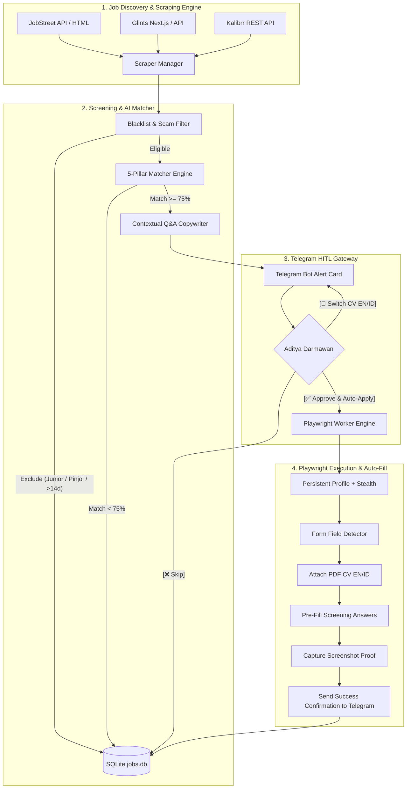

# 🚀 AI Job-Hunting & Auto-Apply Bot (HITL Architecture)

Autonomous Job-Hunting, AI Resume Matching, and Telegram Human-in-the-Loop (HITL) Auto-Apply System tailored for **Aditya Darmawan** (Senior Credit Risk & Underwriting Specialist).

Strictly engineered under **ANTI-SLOP** principles: clean modular Python, asynchronous non-blocking I/O, zero busy loops, persistent browser session state, multi-currency salary normalization, and zero-slop contextual copywriting.

---

## 🏛️ System Architecture



---

## ⚙️ Project Structure

```
job-hunting-agent/
├── candidate_profile.json          # Structured profile data (15+ yrs credit risk, Aspire SEA, Maybank)
├── config.py                       # Typed Pydantic configuration & directory boots
├── main.py                         # Unified CLI entry point (--serve, --scrape, --apply, --stats)
├── requirements.txt                # Production dependencies (playwright, python-telegram-bot, etc.)
├── data/
│   ├── jobs.db                     # SQLite tracking database (WAL mode, async)
│   ├── profiles/default/           # Persistent Chromium user profile & cookies
│   └── screenshots/                # Application audit & submission confirmation screenshots
├── src/
│   ├── core/                       # Core models, async database layer, structured logger
│   │   ├── database.py
│   │   ├── logger.py
│   │   └── models.py
│   ├── scrapers/                   # Job discovery scrapers
│   │   ├── base.py
│   │   ├── glints.py
│   │   ├── jobstreet.py
│   │   ├── kalibrr.py
│   │   └── manager.py
│   ├── matcher/                    # AI screening, blacklist filter & profile loader
│   │   ├── blacklist.py
│   │   ├── engine.py
│   │   ├── matcher.py
│   │   └── profile_loader.py
│   ├── copywriter/                 # Factual screening Q&A generator
│   │   └── form_answers.py
│   ├── telegram_hitl/              # Telegram interactive bot & callback handlers
│   │   ├── bot.py
│   │   ├── handlers.py
│   │   └── messages.py
│   └── execution/                  # Playwright browser automation
│       ├── auto_fill.py
│       ├── form_detectors.py
│       └── playwright_worker.py
├── scripts/
│   └── dry_run.py                  # End-to-end dry-run simulation
└── tests/                          # 28 passing unit & integration tests
```

---

## 🚀 Quickstart & Setup

### 1. Setup Environment Variables
Create `.env` (copied from `.env.example`):
```env
TELEGRAM_BOT_TOKEN=your_bot_token_from_botfather
TELEGRAM_CHAT_ID=your_telegram_chat_id

SEARCH_KEYWORDS=Credit Risk Manager,Credit Risk Analyst,Head of Underwriting,Commercial Banking Relationship Manager,SME Lending Specialist,Credit Policy Lead,Risk Assessment Specialist,Credit Decisioning
SEARCH_LOCATIONS=Jakarta,Tarakan,Indonesia,Remote
MIN_MATCH_SCORE=75
MAX_JOB_AGE_DAYS=14
DRY_RUN=true
HEADLESS=false
```

### 2. Run Tests
Verify system integrity across all 28 test suites:
```bash
python -m pytest -v
```

### 3. Run Dry-Run Simulation
Simulates full pipeline (discovery, blacklist filtering, candidate matching, 2-sentence rationale, contextual Q&A generation, and Telegram card rendering):
```bash
python scripts/dry_run.py
```

### 4. View Pipeline Statistics
```bash
python main.py --stats
```

### 5. Start HITL Daemon
Runs periodic scraping every 4 hours and starts the interactive Telegram bot:
```bash
python main.py --serve
```

---

## 🔒 Strict Human-in-the-Loop (HITL) Policy
- **No auto-apply without explicit Telegram approval**: The bot is architecturally prevented from submitting any job application until Aditya clicks `[✅ Approve & Auto-Apply]`.
- **Dynamic CV Selection**: Candidates can toggle `[📄 CV: EN]` to `[📄 CV: ID]` directly inside Telegram before approving.
- **Audit Proof**: Every approved submission captures a high-resolution screenshot stored in `data/screenshots/` and sent directly to Telegram.
